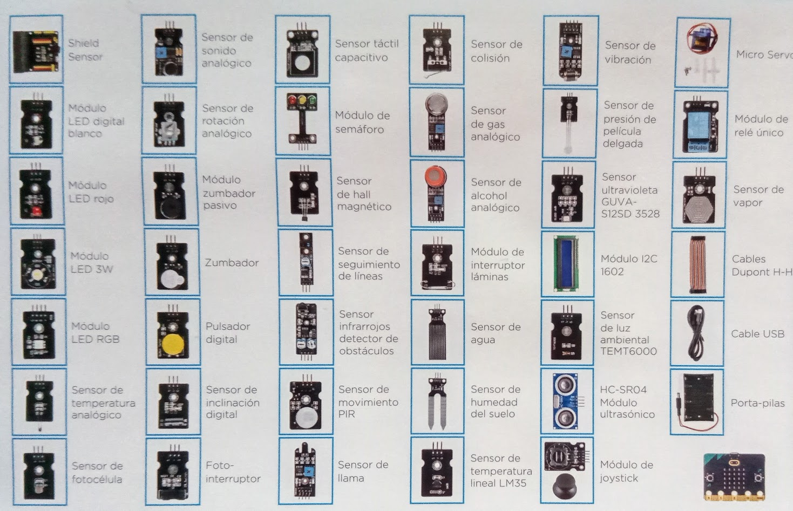
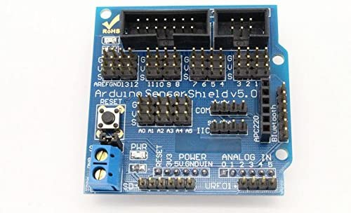
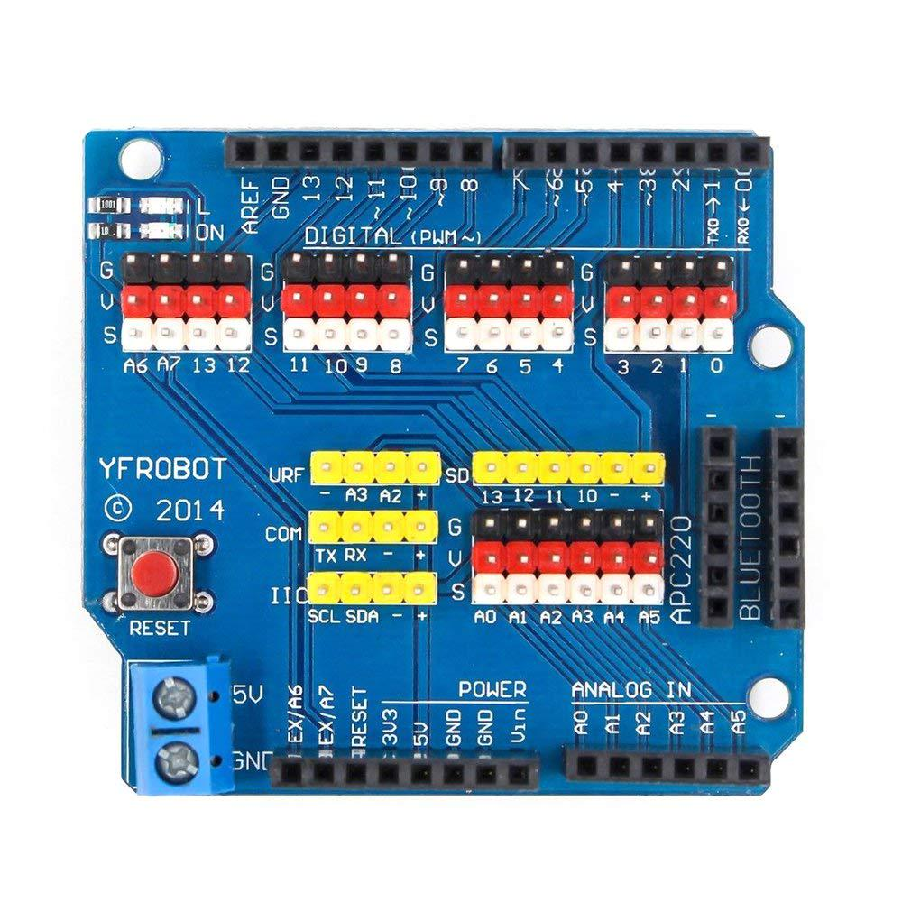
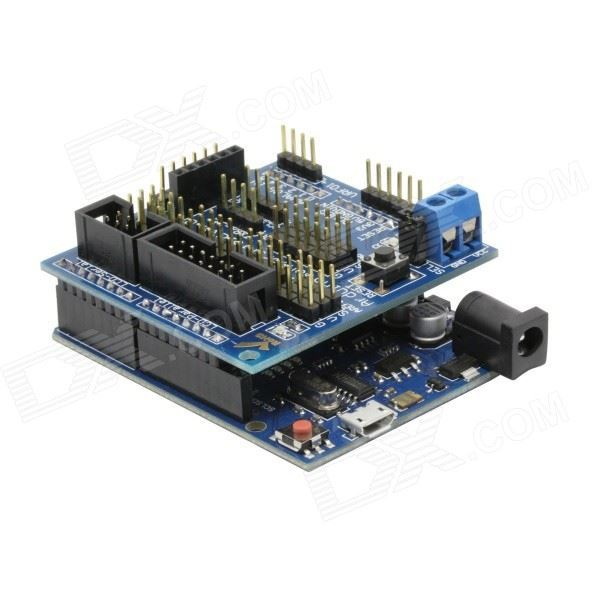
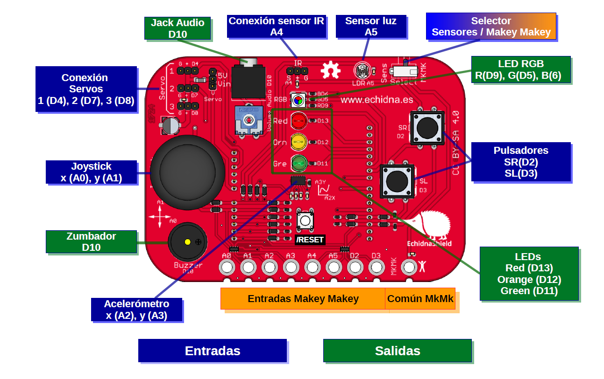

### Sensores

Cuando trabajamos con módulos, generalmente estos disponen de 3 pines:
* Alimentación que suele ser etiquetado como Vcc, el positivo
* GND o tierra, que es el negativo
* Un tercero que suele ser el que transmite la señal bien de control o bien de la medida

Es decir, los módulos tienen los dos pines de su alimentación y un tercer pin al que llamamos señal.

Los sensores pueden medir magnitudes **digitales** que se pueden representar con 2 valores: encendido o apagado, 0 o 1, como por ejemplo un interruptor o bien magnitud **analógica** que pueden tomar cualquier valor dentro de un rango, como por ejemplo la temperatura la humedad el volumen del sonido .

Existen sensores capaces de medir valores analógicos pero que nos proporcionan ese valor de una forma digital utilizando un protocolo de comunicaciones, como por ejemplo la sensor de temperatura DHT

En la mayoría de los sistemas de medida el valor de esta está representado por un número entero habitualmente entre 0 y 1023 se utilizan (potencias de dos)

Esto no quiere decir que siempre vayamos a obtener los valores mínimo máximo depende del rango de la magnitud que nosotros estamos utilizando

Definimos la calibración como el proceso por el que convertimos la lectura de nuestro sensor en un valor de la magnitud física correspondiente. Este proceso de calibración es complejo y costoso

La ventaja de trabajar con módulo es que esto incluye en una electrónica que no hace más sencillo el uso y podemos trabajar de una forma más estándar

El trabajar con componente individuales requiere de un mayor conocimiento de electrónica y que conozcamos los detalles de estos componentes del fabricante

Cuando adquirimos un módulo un componente es necesario que os tengamos la documentación del fabricante que nos va a decir cómo hacer la medida como conectarlo y todos los detalles técnicos

El precio de los kits habitualmente depende mucho del tipo de componentes que incluye cuando traen muchos módulos suelen ser más caros o más baratos incluyen solamente los componentes electrónicos por tanto requieren de un mayor conocimiento de electrónica

A la hora de elegir la placa Arduino, mejor elegir alguna de las versiones más modernas que incluyen más pines y que facilitan su uso

Otra alternativa es que usemos un escudo o shield que nos proporcione esta funcionalidad. Existen distintos modelos

Lo conectamos encima de nuestro arduino y ya tenemos resuelto el tema

También existen otros escudos que ya incluyen muchos sensores y que son ideales para empezar a trabajar, como este [Echidna](./echidna.md)

