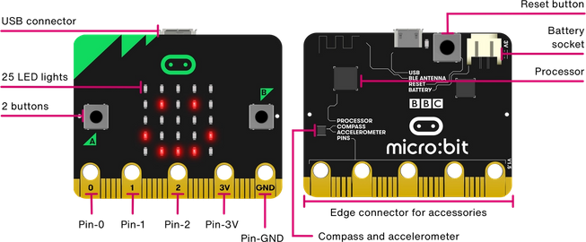
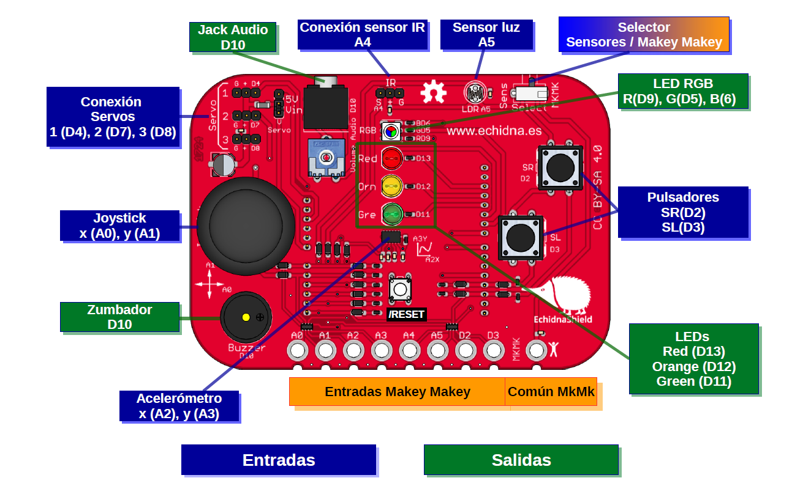

## Ejemplos de robótica en educación

### ¿Por qué usar la robótica en educación?

* Interacción. 
* Conexión con el mundo físico. 
* Introducción a la robótica.
* Introducción a la programación.
* Introducción a la electrónica.

Nosotros usaremos Makey-Makey.

Pero vamos a ver otras alternativas.

## Escornabot

[Escornabot](https://escornabot.com/web/es) es la versión OpenSource, además desarrollada por profes... de los robot de tipo "Abejita"

El objetivo es que los chavales lo usen y a la vez aprendan que pueden construirlo, los componentes de un robot y conozcan la filosofía de compartir conocimiento de forma libre (Open Source)

# [Micro:bit](./8.1.1.Microbit.md)

Es una placa desarrollada por la Fundación BBC y pensada para que todos los escolares británicos aprendan programación, electrónica y robótica.

* Incluye:
    * Muchos sensores
    * Bluetooth/Radio
* Programable con:
    * Scratch lo que permite integrarlo en nuestros programas

    * Bloques/Javascript
    
    * Python
* No necesita drivers
* 18€
* Incluye simulador
* Se puede usar como MakeyMakey
* Podemos usarlo en diferentes etapas con diferentes niveles de complejidad.

## mClon 

100% opensource

## [MakeBlock](./8.1.2.mBlock.md)

* Programable con:
    * Scratch 3.0, lo que permite integrarlo en nuestros programas
    * mBlock
    * Arduino
* Robusto
* Trabajamos la mecánica
* Iniciación a la electrónica y Arduino

## [Echidna](./8.1.3.echidna.md)

* Incluye muchos sensores
* Desarrollado por profes
* Programable con:
    * Scratch 3.0, lo que permite integrarlo en nuestros programas
    * mBlock
    * Arduino
* Iniciación a la electrónica y Arduino

## Arduino

## Lego WeDo

## Lego Ev3

